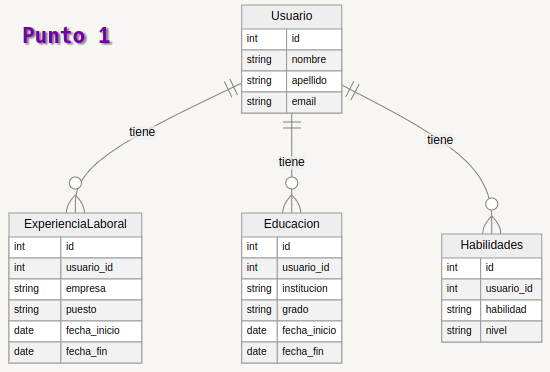

# Taller

```json

{
  "usuario": [
    {
      "usuario_id": 1,
      "nombre": "eduardo",
      "apellido": "García Márquez",
      "email": "eduardo_garcia223@gmail.com",
      "experiencia_laboral": [
        {
          "empresa": "locatel",
          "puesto": "regente",
          "fecha_inicio": "2024-05-23",
          "fecha_fin": "2026-05-23"
        }
      ],
      "educacion": [
        {
          "institucion": "Nicolas Machado IED",
          "grado": "once",
          "fecha_inicio": "2000-01-23",
          "fecha_fin": "2016-12-23"
        }
      ],
      "habilidades": [
        {
          "habilidad": "pensamiento_logico",
          "nivel": "once"
        }
      ]
    }
  ]
}