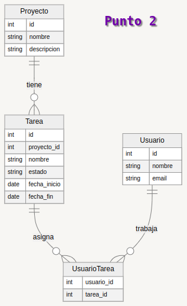

# Taller
.png
```json

{
  "usuario": [
    {
      "id": 1,
      "nombre": "Duvan Andres Florian Salazar",
      "email": "duvan@example.com",
  "Proyecto": [
    {
      "id": 101,
      "nombre": "Proyecto Ejemplo",
      "descripcion": "Descripción del proyecto"
    }
  ],
  "Tarea": [
    {
      "id": 201,
      "nombre": "Tarea Ejemplo",
      "descripcion": "Descripción de la tarea",
      "proyecto_id": 101,
      "estado": "En progreso",
      "fecha_inicio": "2024-08-01",
      "fecha_fin": "2024-08-31"
    }
  ],
  "Usuario_Tarea": [
    {
      "usuario_id": 1,
      "tarea_id": 201
        }
      ]
    }
  ]
}