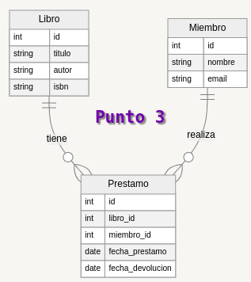

# Taller

```json

{
  "Miembro": [
    {
      "id": 1,
      "nombre": "Eduardo Tchouameni",
      "email": "Tchouameni@correo.com",
      "Prestamo": [
        {
          "id": 1,
          "libro_id": 1,
          "miembro_id": 1,
          "fecha_prestamo": "2024-08-01",
          "fecha_devolucion": "2024-08-31"
        }
      ],
      "Libro": [
        {
          "id": 1,
          "titulo": "Como Banquear En El Real Madrid",
          "autor": "Carlo Ancelotti",
          "isbn": "suave"
        }
      ]
    }
  ]
}